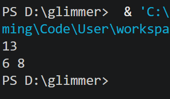

# task1

## ans1

- ##### Java 的八种基本数据类型分别是什么？

  byte、short、int、long、float、double、char、boolean

- ##### 四种整型类型各占多少字节，表示范围大致是多少？

  byte占1个字节，表示范围为$-2^7$\~$2^7$-1

  short占2个字节，表示范围为-$2^{15}$\~$2^{15}$-1

  int占4个字节，表示范围为-$2^{31}$\~$2^{31}$-1

  long占8个字节，表示范围为-$2^{63}$\~$2^{63}$-1

- ##### 解释基本类型与引用类型的区别。

  基本类型保存的是一个具体的数据；

  引用类型只保存了一个地址，指向另一个对象。

- ##### 这里发生的是隐式类型转换还是显式类型转换？

  是隐式类型转换，因为程序中没有用（int）来进行显式类型转换，是编译器自动转换的类型。

- ##### b 的值是多少？请解释为什么。

  b的值是52，因为在计算的过程中发生了隐式类型转换，字符‘0’被转换成了整型数，‘0’作为字符时的编码是48，转换后变为48，而a=4，所以b=4+48=52。

- ##### 写出运行结果，并解释每一步计算过程。

  

  ++a是前置自增符，会先将a的值+1再带入计算：b++是后置自增符，会先把b的值带入计算再将b的值+1。所以c的值是6+7=13。最后a和b的值都+1了，所以打印a和b的结果是6和8。

- ##### 为什么“两个正数相加结果可能变成负数”？请从二进制存储和溢出的角度解释。

  假设有一个数是$2^{31} - 1$，一个数是1，他们都是一个int类型变量，存储在内存中的二进制数分别为0111……11，00……001，两个数加起来时，alu直接把两个二进制数加起来了，最后得到1000……00，这个数作为int类型变量的值时是$-2^{31} $，是一个负数。

- ##### float 为什么可能出现精度问题？你可以简单说明，不要求推导完整标准。

  float由尾数和阶数组成，尾数表示小数时精度有限，因为每一位能表示的数都是$2^{-n}$,当表示一些不能用多个$2^{-n}$相加得到的数时只能得到近似的数值，比如 0.1，所以float可能出现精度问题。

- ##### 如果你愿意进一步挑战，可以再解释一下包装类和缓存池：

  包装类是一种用来包装基本类型的类，这里面有一个对应基本类型的数据成员，用来存放数据，java中的泛型都需要以类为对象，比如list<Integer>，如果没有包装类，就没办法创建存储int类型数据的list。包装类主要功能是存一个对应基本类型的数据，不过也提供了一些类函数，比如构造函数、valueof。     
  当执行下面的函数时   
  Integer x = new Integer(18);
  Integer y = new Integer(18);
  System.out.println(x == y); 
  最后会输出false，因为x和y都指向的一个新创建的Integer实例，虽然这两个对象存的值都是18，但他们是不同的实例。
  当执行下面的函数时 
  Integer z = Integer.valueOf(18);
  Integer k = Integer.valueOf(18);
  System.out.println(z == k); 
  最后会输出true。
  因为调用valueOf时，jvm会先在缓存池里找有没有存这个数的包装类，而java默认的缓存范围是-128~127，所以能找到18对应的包装类，因此z和k都指向的缓存池中的那个实例，==判断时结果是true。
  当执行下面的函数时 
  Integer m = Integer.valueOf(300);
  Integer p = Integer.valueOf(300);
  System.out.println(m == p); 
  最后会输出false。
  因为300已经超过了java默认的缓存范围，所以执行valueOf时会创建一个新的实例，因此m、p指向的不同的实例，==判断时结果是false。

  
