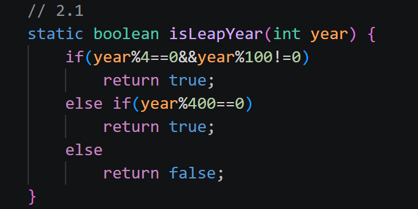
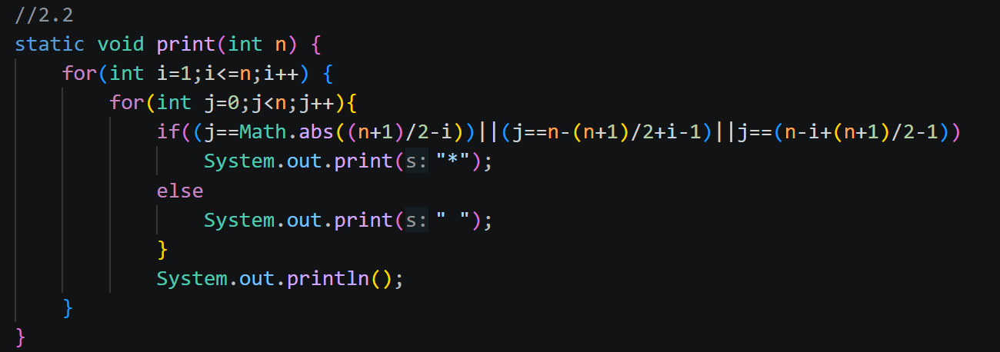
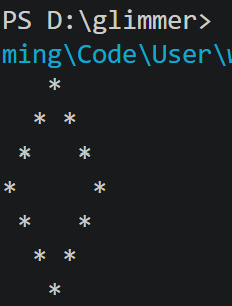
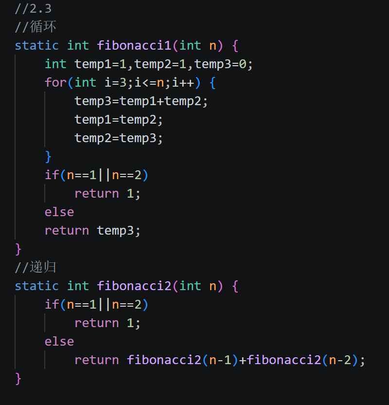

# task2
代码都写在task2.java里了。
## ans2.1

- ##### switch-case 和 if-else 的适用场景分别是什么？
switch-case：当要判断的条件比较少且离散的时候比较适合，比如判断枚举值时，对不同的情况进行不同的处理。
if-else：当要判断的变量的取值是一个连续的范围的时候比较合适，比如判断某个数是正数还是负数时，这时就没办法用switch-case来列举出每一种情况。
- ##### 有人说 switch-case 是 if-else 的“语法糖”，你是否同意？请说出你的理由。
不同意，首先这两种写法适用的范围并不一样，其次虽然有时switch-case可以被写成if-else的形式，但两者在编译为字节码文件时，会被编成不同的形式。
## ans2.2

代码在task2.java里。
## ans2.3

代码在task2.java里。

- ##### 递归和迭代的核心区别是什么？
递归是函数不断调用自身，直到达到终止条件为止，程序的状态通过函数调用栈保存。
迭代是通过for、while这样的循环结构不断重复一段代码，直到达到终止条件，数据通常用局部变量保存。
- ##### 为什么很多场景下更偏好迭代？
迭代占用的空间更少，递归每一次调用函数都要创建一个新的栈帧，保存相关的函数的信息，当递归的层数很深时可能导致栈溢出。
- ##### 循环是否总能被递归取代？如果能，代价是什么？
能，代价是占用更多的空间、处理的速度可能变慢、可能栈溢出。
